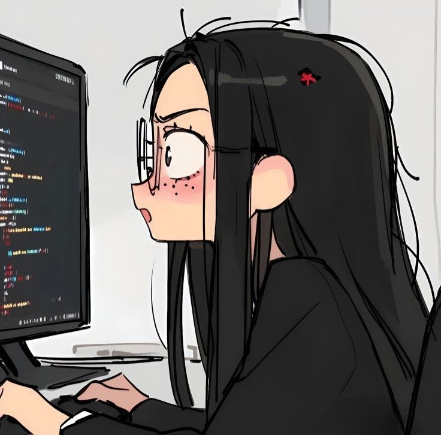

<!-- Header Section -->
<h1 align="center">
  
</h1>

---

## 🌟 About Me  

  

- 📖 Reader at heart, coder in progress.  
- 💻 Python · Java · React · Flask/Django · SQL/MongoDB · Pandas · Power BI — all on my learning plate.  
- 📚 Literature fed my mind, now code feeds my curiosity.  
- 🐞 Debugger in training, builder of small but mighty projects.  
- 🚀 Goal: projects that survive production (and earn a ⭐ or two).  
- ⚡ Believe in small steps, big learning, and fewer runtime errors.  

---

## 🛠️ Tech Stack  

  

---

## 📊 GitHub Stats  

  
  

---

## 🌱 Contribution Graph  

  

---

## 📫 Connect with Me  

  
  

---
